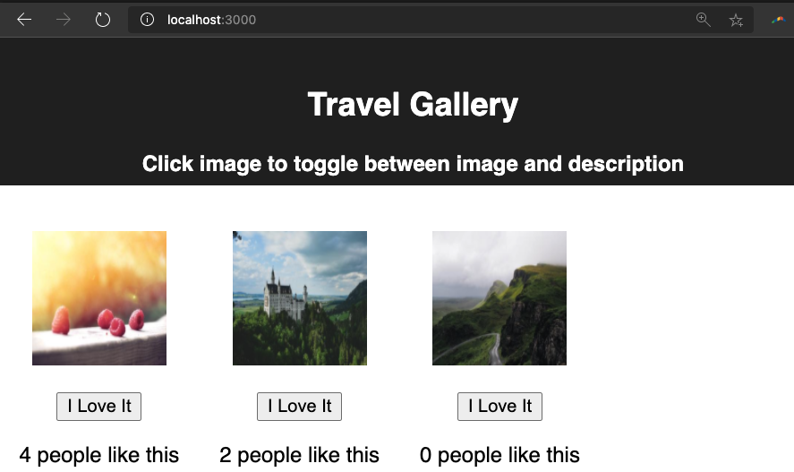

# Project Name: react gallery

## Prerequisites:
Running this app requires some setup to access the provided data and to view the app in your browser. **Follow the instruction below**

    Running the server code requires `nodemon`. If you don't already have `nodemon`, install it globally with `npm install nodemon --global`.

    ```
    npm install
    npm run server
    ```

    Now that the server is running, open a new terminal tab with `cmd + t` and start the react client app.

    ```
    npm run client

    A new browser window will open so that you can view the app on **localhost:3000**. The app will now being run in your browser.


## Description:

This app provides for the display a series of images. You can click on the image to display a brief description of the image. Clicking on the desciption will return you to the image.

You can also click to __love__ an images. After clicking the --I love it-- button refresh the window to see the total number of loves.


## Screen shot.

